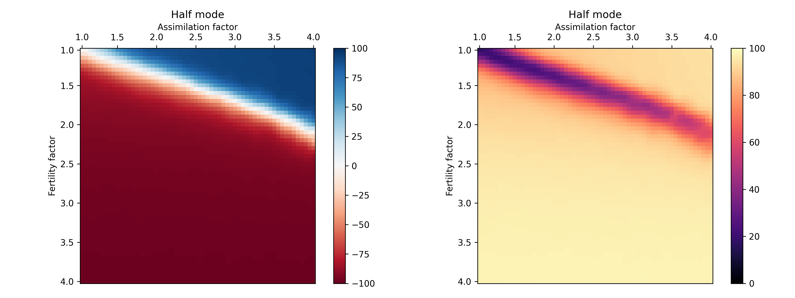
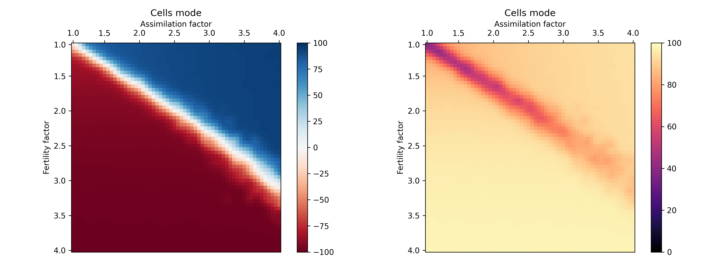
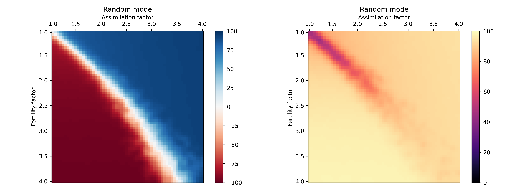

## Simulator of cultural rivalry

### Introduction

The problem is inspired by the r/k selection theory. The main idea is to have two 
population where one has a higher growth rate and the other is a stronger competitor.
This model is applied to agent interaction.

This environment models the process of cultural assimilation with asymmetric
strategies. Agents here:

- are mortal. Each has an `age` attribute, measured in ticks of the simulation.
- move randomly in all directions.
- can breed. Fertility depends on the strategy.
- exchange messages. Every tick agent sends messages to all agents in close range.
  The message contains the `culture` value of the sender.
- have a `culture` attribute. It defines the agent's strategy and belonging to one of the
  populations. Acquires value from -100 for `RED` up to 100 for `BLUE`

`RED` - Have more children per individual (greater fertility factor). 
`BLUE` - Have the ability to assimilate more efficiently (greater assimilation factor).

The application has two modes of operation:

- Gui mode - mode allows the user to follow simulation dynamics.
- Analysis mode - build the heatmap of the parameter space of the simulation.

Gui mode is the default when running the app via executable jar. Analysis can be started
only with IDE. Mode switch with command-line flags TBA.

#### Example of simulation dynamics

`RANDOM` disposition for 15000 agents.

  
  
  

### Rules of the simulation

#### Number of agents

There are a fixed number of agents per simulation run. During the run, their number
remains constant according to these rules:

- every tick `age` increased by 1.
- agents die when their `age` gets bigger than `TOTAL_STEPS_OF_LIFE`.
- when the agent dies, a new agent with random `culture` and random `age` will spawn
  in a random location.
- when a new agent is born, a randomly selected agent will be wiped out from the board.

Such rules effectively mean that we see only a slice of the actual population,
nevertheless, this slice is uniformly distributed, so it keeps a relative amount
of agents on the board.

#### Movement of agents

- Agent picks a random direction and a random number of steps it will perform
- Repeat when the counter of chosen direction goes to zero.

The simulation board comes as a toroidal wrap space, so if an agent crosses the upper border,
it will appear at the bottom (same for left and right). All distances between agents
are calculated accordingly.

#### Reproduction of agents

The lifetime of the agents is separated into three equal sub-periods. During the mid-period
agents can breed. Reproduction is driven by a normal distribution with the mean equal
to the according [fertility](#gui-mode).

#### Message exchange

With each tick, an agent sends messages with its (sender's) culture level to all agents
within `communicationRadius`. Since `communicationRadius` is the constant for the
simulation run and is equal for all participants, message exchange between two agents
is always mutual. An agent who receives the message slightly adjusts its (receiver's)
`culture` level.

Messaging is the key part of the simulation. Two different approaches were tested:

- Receiving and sending agents adjust their `culture` to the average of both
  communicating parts. This strategy leads to the situation when all agents on the
  board gravitate towards the `culture` = 0, or it wipes out any population deference.  
  This approach was rejected because it weakly corresponds to reality.

- Receiving agent adds some fraction of the sender's `culture` to its own. This
  creates an environment where in isolated areas, agents of the same population
  mutually push each other to more extreme values of the `culture`. This approach is
  applied in the simulation.

### Analysis

#### Setup

The analysis explores the 2d parameter space:

- `Assimilation factor` - roughly speaking, it is the multiplier of how much `BLUE`s
  are more efficient at in inclining `RED`s on their side. Strictly speaking, it is
  the additional message multiplier for all agents whose `culture` is greater than 0.
- `Fertility factor` - the multiplier of how much faster do `RED`s reproduce than
  `BLUE`s. Here `BLUE` fertility is fixed at 1.5 and remains constant, so
  `RED` fertility is calculated as 1.5 * `Fertility factor`.

All parameters are set according to [defaults](#analyser-mode) unless otherwise
explicitly specified. For clarifying: 1000 agent, 1500 ticks of the simulation
(or five lifetimes of the agent, since one can live 300 ticks max)

#### Results

It is necessary to say that with an infinite amount of ticks to run, one of the population
will inevitably take an irresistible advantage over the other. It is just a question
of time. However, it does not mean the 'losing side' will become completely extinct since
agents can appear with random `culture`. It means that the number of agents on the
'losing side' will be so small that they will never be able to recover above a few
percent.

Analyse was performed for three different staring
[dispositions](#appendix-a---parameters-of-the-simulation):
`HALF`, `CELLS`, and `RANDOM`.
For each disposition were built two(!) 60 by 60 heatmaps, and for each cell of the
heatmap (do not mess with `CELLS` disposition) the simulation was run 10 times.
The analysis is parallelized. On the Intel i7-8700 CPU, the full analysis took about 3 hours.

Two different types of heatmaps are necessary because of possible interpretation
ambiguity.

- Left heatmap shows the normal average. Cell compute procedure:
    - take parameters according to the cell
    - run the simulation
    - compute the average `culture` level across all agents on the board
    - repeat 10 times
    - compute the average value across all simulation runs per cell.
      It will represent the result

The ambiguity lies in the interpretation of the white color. It can be interpreted
as "both populations have an equal amount of agents after the simulation run" or
"both populations finished 'winners' an equal number of times". Because of that
second heatmap is needed.

- Right heatmap shows the absolute average. Cell compute procedure:
    - take parameters according to the cell
    - run the simulation
    - compute the average `culture` level across all agents on the board
    - **take an absolute value from the previous step**
    - repeat 10 times
    - compute the average value across all simulation runs per cell.
      It will represent the result

Thus right heatmap distinguishes the situation when at the end of the simulation
both populations are equally represented (dark shade), or only one population
'wins' (light shade). We, however, cannot read from the right heatmap which one
of the population 'won' (if any), so we need both heatmaps to clearly interpret
the result.

Result heatmaps were post-processed with a Gaussian filter with `sigma` = 1.

##### Half mode

Here we can see the strict border between `RED`s and `BLUE`s with the noticeable dark region
on the right map. If parameters are appropriately set, it is possible to
keep the balance for at least five full generations. Otherwise, the `RED`s have a
much larger area of the parameter space.

##### Cells mode

In this experiment, we can see that on the right map, the borderline is way less dark
and that the same region on the left map diverges. It means that
on the borderline situation not only collapses more frequently to one of the
population, making the whole equilibrium even less stable, but that borderline itself is
getting wider in comparison with the `HALF` disposition.

Another valid observation is that results with `BLUE`s 'winning' now take up more
area of the parameter space.

##### Random mode

Here we see a continuation of the trend from the previous example. `BLUE`s now
occupy more than a half of the parameter space, borderline diverges more explicitly
and became more light on the right map, which means that at the extreme value of
the parameter the simulation becomes totally chaotic, with a small or zero chance of
predicting the result beforehand.

#### Conclusion

According to conducted experiments, the relation between the `Assimilation factor` and
`Fertility factor` is not linear and depends on the starting disposition.
More precisely, it depends on the contact boundary length between populations.
Longer the contact boundary - the bigger chance for the `BLUE`s and vice versa.
In a `RANDOM` disposition, contact boundary length is actually the maximum.

Because of that, in the run of the simulation, the following features can be
distinguished, which, however, are not determined by the logic of the behavior
of agents, but exclusively by their interaction.

- `RED`s are trying to minimize their contact zone with `BLUE`s in fact creating
  round compact areas where they can safely reproduce.
- Each lonely `RED` agent without a group will be assimilated and
  become a `BLUE` one.
- If the `RED` group was able to survive, it starts actively reproducing itself,
  consistently raising their relative numbers but staying in a compact area.
  When the relative number of `BLUE`s drops below a certain limit, `RED`s break out of
  their 'capsule' and occupy the hole board.
- If `RED`s was unable to cluster themselves into a group (the group was too small,
  the group did not have an optimally minimal contact zone) they will be assimilated
  by `BLUE`s.

One more conclusion is that with the growth of the parameters, value simulation
becomes more chaotic and hard to predict. This relation is affected by the
disposition as well. A greater contact zone leads to a more unpredictable result.

### Possible extensions

Several ideas to extend the environment:
- Add the possibility of creating borders and/or gates on the simulation board. This
  meant to represent inter-district/interstate borders where crossing them is limited
  in one way or both.
- Make a more precise simulation of humans adopting the near culture. Especially the 
  observation that younger individuals are more tolerant of the cultural transition 
  than their older parents. This aspect is currently ignored.

### Codebase of the project

Project is posted on the faculty gitlab as 
[cultural-darwinism-simulator](https://gitlab.fi.muni.cz/xdudin/cultural-darwinism-simulator)

### Appendix A - Parameters of the simulation

Name of parameter = default value. Constants are hyper-parameters.

The simulation board itself has the `PLAYGROUND_SIZE` = 100 parameter. All spatial
modifiers (marked with *) are, in fact, fractions of the `PLAYGROUND_SIZE`.

`DISPOSITION` is starting the configuration of agents on the board. In all cases, starting
the number of `RED`s and `BLUE`s are equal.

- `RANDOM` - `age` and `culture` are uniformly distributed
- `HALF` - the left half of the board is `RED`, right half is `BLUE`
- `QUARTER` - the board is divided into 4 alternating quadrants
- `FOUR_LINES` - the board is divided by 4 alternating vertical lines
- `CELLS` - the board is divided into 16 alternating quadrants
- `CIRCLE` - `RED` agents are located in the middle of the board and grouped into a circle.

#### Gui mode

| Description                              | Parameter             | Default value |
|------------------------------------------|-----------------------|---------------|
| Radius of the agent on the board*        | `AGENT_RADIUS`        | 1.15          |
| Agent's maximum lifetime                 | `TOTAL_STEPS_OF_LIFE` | 300           |
| Distance covered by agent in one tick*   | `distancePerStep`     | 0.08          |
| Radius of agent's communication*         | `communicationRadius` | 5             |
| Culture multiplier in message exchange   | `messageFactor`       | 0.001         |
| Additional culture multiplier for `BLUE` | `assimilationFactor`  | 3             |
| `RED` fertility                          | `k_fertility`         | 1.5           |
| `BLUE` fertility                         | `r_fertility`         | 4.5           |

#### Analyser mode

| Description                              | Parameter          | Default value |
|------------------------------------------|--------------------|---------------|
| Number of agents                         | `NUMBER_OF_AGENTS` | 1000          |
| Number of ticks per run                  | `NUMBER_OF_STEPS`  | 1500          |
| Result heatmap resolution                | `GRANULARITY`      | 2             |
| Number of repeated runs per heatmap cell | `NUMBER_OF_ROUNDS` | 4             |
| Starting configuration of agents.        | `DISPOSITION`      | `RANDOM`      |
